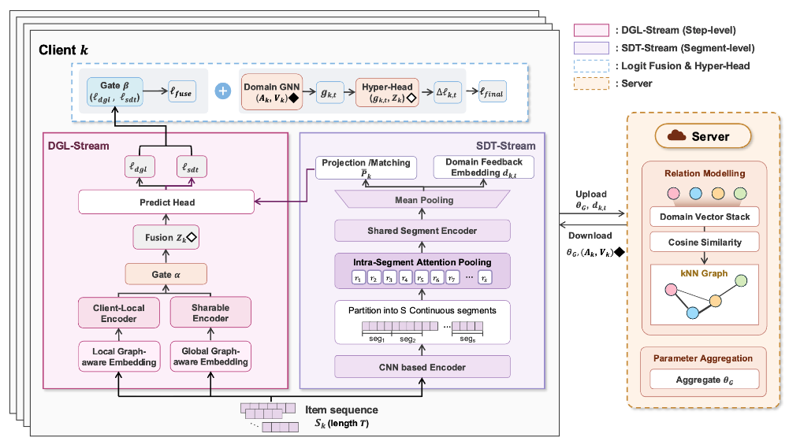

# FedSegGNN: Federated Segment-aware Graph Neural Network for Cross-Domain Sequential Recommendation

## Overview

<p align="center">
  
</p>

FedSegGNN is a federated framework for cross-domain sequential recommendation under **non-shareable item spaces**. It keeps item-dependent modules (embeddings, prediction heads) local while federating only item-agnostic sequence modeling components.

**Key components:**
- **DGL-Stream** — Step-level disentangled global–local representation stream that captures fine-grained sequential dynamics.
- **SDT-Stream** — Segment-based domain token stream that compresses variable-length histories into fixed-size, item-agnostic domain tokens.
- **DomainGNN** — Server-side similarity graph constructed from uploaded domain embeddings for relation-aware client coordination.
- **HyperHead** — Lightweight module that produces logit-space corrections conditioned on inter-client relational context.

## Requirements

```bash
pip install -r requirements.txt
```

**Core dependencies:** Python 3.8+, PyTorch ≤ 1.7.1, NumPy, SciPy, tqdm

## Dataset

We evaluate on **KuaiRand-27K**, a large-scale short-video recommendation benchmark with multiple exposure scenarios. We consider a four-domain cross-scenario setting (Tab0, Tab1, Tab2, Tab4).

| Domain | #Users | #Items | #Sequences | Avg Length |
|--------|-------:|-------:|-----------:|-----------:|
| Tab0   |  6,471 | 24,804 |     19,413 |      70.34 |
| Tab1   | 27,000 |361,056 |     81,000 |      97.65 |
| Tab2   |  2,200 | 17,317 |      6,600 |      84.01 |
| Tab4   | 15,055 |109,904 |     45,165 |      85.48 |

Place your preprocessed data under the `data/` directory. The folder structure is preserved in this repository; populate each domain folder with the corresponding data files.

## Project Structure

```
FedSegGNN/
├── main.py                 # Entry point with full data pipeline
├── fl.py                   # Federated learning orchestration
├── server.py               # Server-side aggregation and graph construction
├── client.py               # Client-side training coordination
├── trainer.py              # Training and evaluation logic
├── dataset.py              # Dataset class
├── dataloader.py           # Custom dataloader
├── local_graph.py          # Local item relation graph
├── losses.py               # Loss functions
├── models/
│   ├── segfedgnn/          # FedSegGNN (Ours)
│   │   ├── dual_stream_model.py   # DGL-Stream + SDT-Stream
│   │   ├── domain_hyper.py        # DomainGNN & HyperHead
│   │   ├── dgl/                   # DGL-Stream modules
│   │   └── sdss/                  # SDT-Stream modules
│   ├── sasrec/             # SASRec baseline
│   ├── vsan/               # VSAN baseline
│   ├── vgsan/              # VGSAN baseline
│   ├── cl4srec/            # CL4SRec baseline
│   ├── duorec/             # DuoRec baseline
│   └── contrastvae/        # ContrastVAE baseline
├── utils/                  # Data, IO, and training utilities
├── run.sh                  # Main training script
├── train_csta.sh           # Multi-seed experiment runner
├── train_baselines.sh      # Baseline training script
└── train_feddcsr.sh        # FedDCSR baseline training script
```

## Training

### FedSegGNN (Ours)

```bash
bash run.sh
```

Key environment variables for customization:

```bash
METHOD=SegFedGNN           # Model selection
MAX_SEQ_LEN=200            # Maximum sequence length
SDSS_NUM_SEGMENTS=64       # Number of segments (S) in SDT-Stream
DOMAIN_KNN_K=2             # Top-k neighbors for DomainGNN
HYPER_RANK=1               # Rank for HyperHead
EPOCHS=20                  # Communication rounds
LOCAL_EPOCH=1              # Local training epochs per round
BATCH_SIZE=8               # Batch size
LR=0.001                   # Learning rate
SEED=42                    # Random seed
GPU=0                      # GPU device ID
```

Example with custom settings:

```bash
METHOD=SegFedGNN MAX_SEQ_LEN=200 SDSS_NUM_SEGMENTS=64 SEED=42 GPU=0 bash run.sh
```

### Baselines

Federated baselines (FedSASRec, FedVSAN, FedVGSAN, FedContrastVAE, FedCL4SRec, FedDuoRec, FedDCSR):

```bash
METHOD=FedSASRec bash train_baselines.sh
```

Local baselines (without federation):

```bash
METHOD=LocalSASRec bash train_baselines.sh
```

### Multi-seed Experiments

```bash
bash train_csta.sh
```

## Results

Performance on KuaiRand-27K (four-domain setting, macro-average):

| Method | MRR | HR@10 | NDCG@10 |
|--------|----:|------:|--------:|
| FedSASRec | 6.37 | 12.50 | 6.94 |
| FedVSAN | 6.47 | 12.68 | 7.12 |
| FedContrastVAE | 7.13 | 13.46 | 7.75 |
| FedCL4SRec | 6.60 | 12.29 | 7.22 |
| FedDuoRec | 6.17 | 11.87 | 6.71 |
| FedDCSR | 8.07 | 15.57 | 8.86 |
| **FedSegGNN (Ours)** | **14.35** | **27.25** | **16.52** |

## Citation

```bibtex
@article{fedseggnn2025,
  title={FedSegGNN: Federated Segment-aware Graph Neural Network for Cross-Domain Sequential Recommendation},
  year={2025}
}
```

## Acknowledgments

This codebase builds upon [FedDCSR](https://github.com/orion-orion/FedDCSR). We thank the original authors for their open-source implementation.
